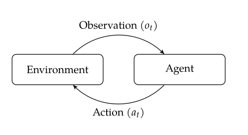

# 指定决策

代理(agent)是基于对环境的观察而采取行动的实体。代理可能是物理实体，像人类或者机器人；也可以是非物理实体，例如决策支持系统。如下图所示，代理和环境的关系符合观测-行动圆环(observe-act-cycle)或循环(loop)。

代理在时间$t$接受到环境的一个观测，表示为$o_t$。观测可以通过人体的生物传感过程获得或者通过通过传感器系统如空中交通管制中的雷达。观测一般是不完整的或者是有噪声的。之后代理通过一些决策过程选择一个行动$a_t$。这个行动，如播放警报，对环境具有不确定的影响。

我们的重点是那些智能交互以随着时间的推移实现目标的代理。给出了过去的观察序列$o_1,\cdots,o_t$和关于环境的知识，代理必须在各种不确定性因素存在的条件下选择行动$a_t$来最好地接近目标，不确定性包括：

1. 结果不确定，我们行动的效果是不确定的
2. 模型不确定，我们对这个问题的模型是不确定的
3. 状态不确定，环境的真正状态是不确定的
4. 交互不确定，在环境中相互作用的其他主体的行为是不确定的

